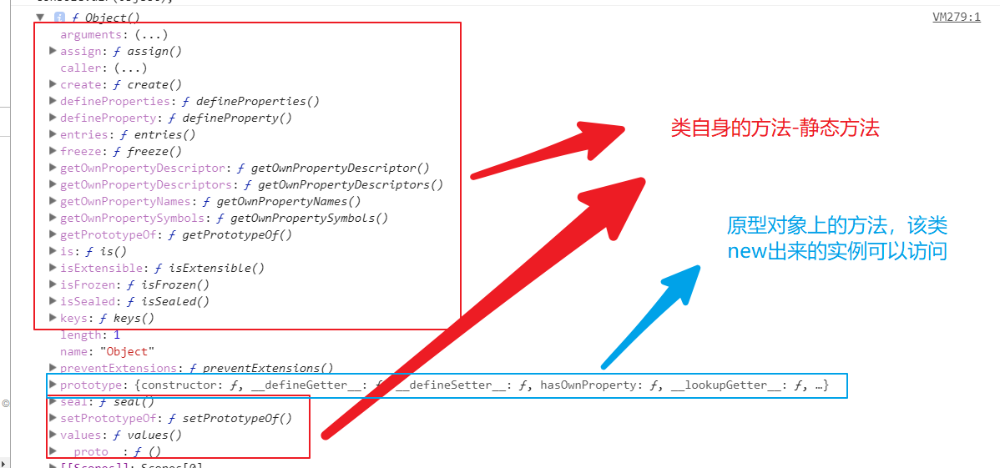

## 参数列表和数组的相互转换

1. 使用es6的扩展运算符  `...`
2. 
```js
var arr = [1,2,3];
function add(a,b,c){
    return a + b + c;
}

// add(arr[0],arr[1],arr[2])
add.apply(null,arr);
```

## 研究Object

1. 这是一个函数（类）；

2. 该类身上有自身的方法还有原型的方法


    1. `Object.create`参数一个对象（原型对象）去创建一个新的实例对象

    2. `Object.defineProperty`和`Object.getOwnPropertyDescriptor`
```js
Object.defineProperty(对象，要配置的属性名，配置对象)
// 配置对象  
// 数据属性 {value: 12, writable: true, enumerable: true, configurable: true}
// 访问器属性  {get: ƒ, set: ƒ, enumerable: false, configurable: true}

Object.getOwnPropertyDescriptor(对象，要查看的属性名); // 返回配置对象
```
    3. `Object.defineProperties`和`Object.getOwnPropertyDescriptors`
```js
    var obj = {a:1,b:2,c:3}
    Object.defineProperties(obj,{
        a:{
            value:0
        },
        b:{
            value:0
        },
        c:{
            value:0
        }
    })

    Object.getOwnPropertyDescriptors(obj); 
```
    4. `Object.entries`
```js
var obj = {a:0,b:0,c:0}
Object.entries(obj); // =>  [['a',0],['b',0],['c',0]]
```
    5. `Object.freeze`
```js
var obj = {a:0,b:0,c:0}
Object.freeze(obj); // 该方法让obj中的所有属性都不可以被修改
```
    6. `Object.getOwnPropertyNames`
```js
// 获取对象自身的所有属性名（字符串）
var obj = {a:0,b:0,c:0}
Object.getOwnPropertyNames(obj); // ['a','b','c']

/*
    for in 可以枚举到隐式原型的属性
*/
```
    7. `Object.getOwnPropertySymbols`
```js
    // 如果对象的属性名是Symbol类型的话，那么for in将不能枚举到
    var a = Symbol();
    var obj = {[a]:1}
    Object.getOwnPropertySymbols(obj) // [Symbol值]
```